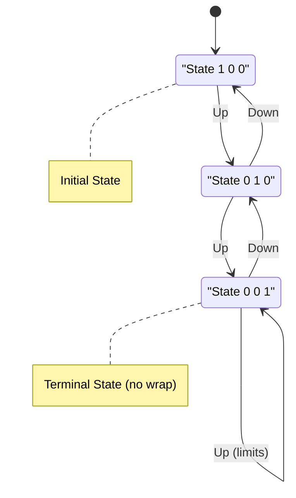
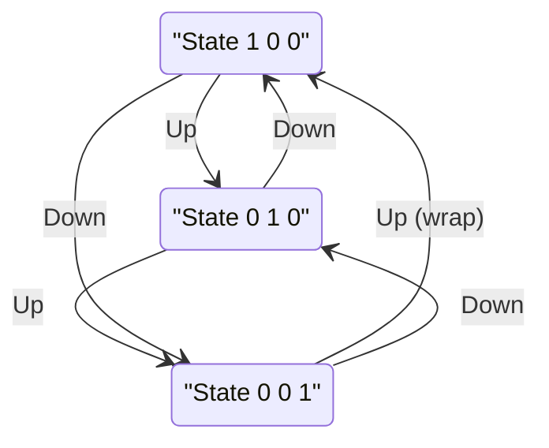

# ACS-85-0710

Button Select - Single value state

## Overview

Controller sketch that allows you to select pins with two buttons.  One for up and one for down.

The output is a single pin going high. See state diagrams.

There is an internal software switch that allows the states to wrap. This is declared at compile time and is not configurable in real time.

up    | down   | State |  notes
--- | --- | --- | ---
 0   |  0  | 1 0 0  |  init
 1  |  0  |  0 1 0  |  press up button
 0  |  0  |  0 1 0  |  release
 1  |  0  |  0 0 1  |  press up button
 0  |  0  |  0 0 1  |  release
 1  |  0  |  0 0 1  |  press up button  it limits
 0  |  0  |  0 0 1  |  release
 0  |  1  |  0 1 0  |  press down
 0  |  0  |  0 1 0  |  release
 0  |  1  |  1 0 0  |  press down

Wrap can be configured with the following line of code
 
```
    boolean doWrap = LOW;
```


## State Diagram - mermaid

for funsies  



When wrap mode is enabled (`doWrap = HIGH`), the states form a circular pattern:



## Pinout


## Examples
